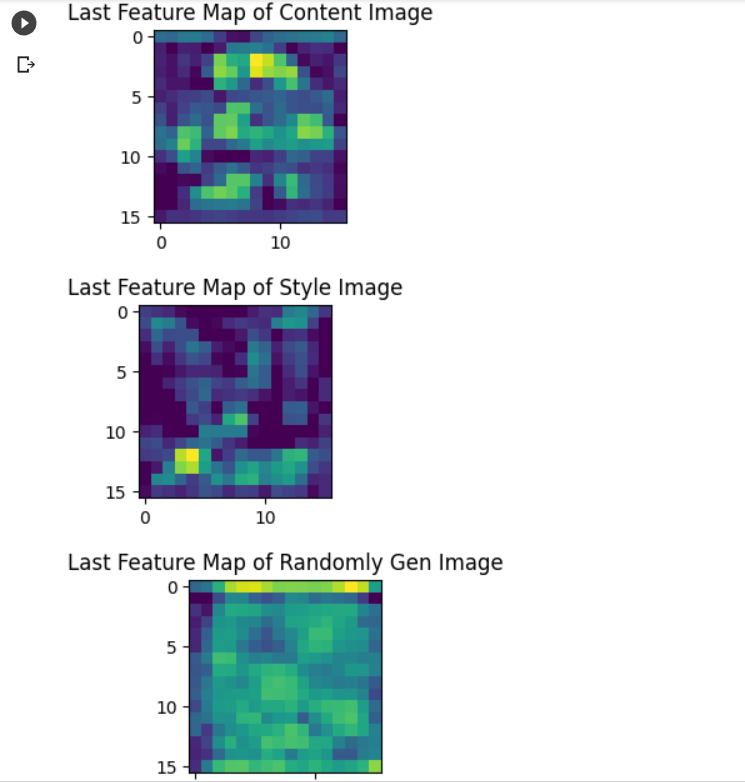

# Neural Style Transfer      

Built as a part of (CSOC Week-4 Project).

In this project , I have tried to explain through proper in-code explanations and semantic code one of the most exciting features of Computer Vision today -    
<b>Neural Style Transfer</b> .

## What is neural style transfer ?

In the simplest version , we can think of it as a tool to help us explore the prediction of how the  content image would have looked had it been painted by artist of the style image .

Now , a bit more technical definition , neural style transfer (as quoted in the 2015 paper -https://arxiv.org/abs/1508.06576 ) is a DL algo. in which happens the transfer of style of the <b>style referene image</b> to the <b>content image</b> while still retaining most of the original content now integrated with a new style , Hencefoorth giving a beautiful representation of the content image in a new way ( a pavement for the VFX industry , right ?).

## What's special in this code ?

 

Well , after watching a lot of tutorials over the Internet and some ChatGPT help (not gonna lie :) , I had quite a look on many NST  projects but what they lacked was a line-to-line dcumentation for the completely unaware coders , so , I have tried to explore and answer even the slightest doubts in my in-line comments.
Also , here I have explored all possibilities and tried  using two approaches to do the Neural Style transfer 

1. <b>Approach 1 - </b>
   Using a pre-trained and pre-coded stylization model (based on VGG19 model) which just required a input and output without any hyperpramaeter setting or hard-coding (just do some pre-processing , thats all !)

But hey , Who likes the easy work , RIGHT ??? So , I have used another approach 

2. <b>Approach 2 -</b>

In this , I trained my model from scratch , defined my own functions and did my own pre-processing and then did all the hard-coding work tranging from programming the custom layers to custom loss functions on my own .

## Code Expalnation

So , first my Logic - 

Wll , first let me explain to you how do NST work . 
Imagine a machine that can show you for any given image , the most unseen patterns / objects / cool features in image ( like position of eyes in a Monalisa Painting or undetectable UFO sightings in an image !!!)

Now , VGG19 (a CNN architecture from 2014 made of repeating 2 Convolutional Layers and a Pooling Layer ) is the machine here . 

First , we give the content image to the pre-trained vgg19 model which extracts all of its features (low level initially anfd high level at ending ) and the final output will be - the most prominent feature map of the content image .

Now , we use this feature map's content  and our randomly generated content image's content to evaluate a content loss (in the matrix way of course !)

<b>PS </b>- Activation Function is Relu ( Relu(x) = MAX(0,x))

Now , what about the style ? Well , it works a bit differently . Since , a style has too many patterns to capture on which has to be distributed throught the image , we capture each of the intermediate feature map of the style image (after putting it in same VGG19 model ) and convert all these style's feature map into a gram matrix ( due to its INTERESTING PROPERTY TO SHOW RELATION BETWEEN DIFFERENT  PIXELS OF SAME IMAGE . ) Now ,after each convolution , we evaluate the style loss from the gram matrix of randomly generated image at that instant and gram matrix of the styl image's feature map at that instant .

<i> I have divided the gram matrix with size of respective feature map  so that the translational invariance does NOT hamper the results . </i>

Now , our job is to minimize these  content loss and style loss  functions both simultaneously.
Better represented as - 

## Optimizations

Now , for minimizing the content loss+ style loss , I came across two optimizers -
<ul>
<li><b>Adam optimizer</b>- &nbsp; fast but could NOT give good results (requiring large number of epochs).

<li><b>L-BFGS Optimizer</b>-  &nbsp;Has a habit of giving good results (unfortuantely , I could NOT see ) but computationally too expensive , so ,use it at your own risk of GPU .

</ul>

Also , while using L-BFGS Optimizer , remember to flatten the image too as this optimizer takes images ONLY in the form of vectors .

Calculate the gradient of loss wrt the generated image and minimize it using any of the above algo.
Now , after using such a minization , we should have arrived at a well defined image with closeness in style and content both to the original input images and EUREKA !!! we have built our first NST model .

# Results 

 &nbsp;&nbsp;&nbsp;➡️  &nbsp;&nbsp; &nbsp; &nbsp;

## Acknowledgements

 - [COPS IIT(BHU) 💻 ](https://www.copsiitbhu.co.in/)

 - [The Stylization Model from Tensorflow  🔍](https://tfhub.dev/google/magenta/arbitrary-image-stylization-v1-256/2)

 - [For sharing 😀 ](https://github.com/hecker1002)

## Suggestions 

Feel free to change the hyperparameters and play with them (like <b>epochs , content loss weight , style loss weight , etc</b>) to explore more varied results .

Try to keep the reference images in the same path as the notebook as I have used relative Path .

Also , while going through the text , I got my hands on some cool CNN architectures like EfficientNetB87 so try that too ! and for In-detail documentation , please go through the code itself .

Though I could NOT use Tensorboard , I ahve given the instruction to use it in inline code 
## Shortcomings 

At last , I was stil NOT able to achieve my 100 % goal which includes -

- Not able to generate a good composite image by using my own model so I pan to experiment more on my hyperparameters in future and detect fatal errors .

- Use a TV Loss (Total Variation Loss ) to give smoothness to the image 
Infact , I am currently still working to eliminate these shorcomings 

## License

[MIT](https://choosealicense.com/licenses/mit/)

